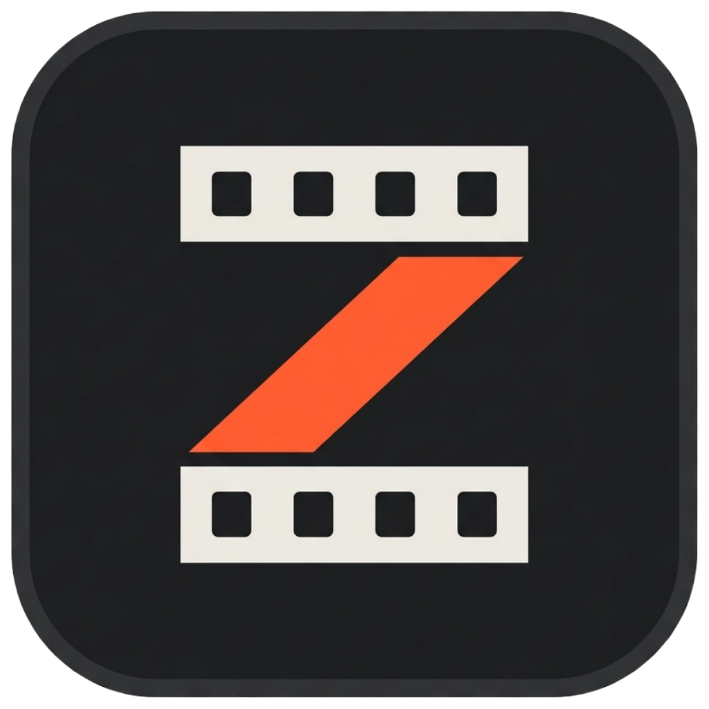
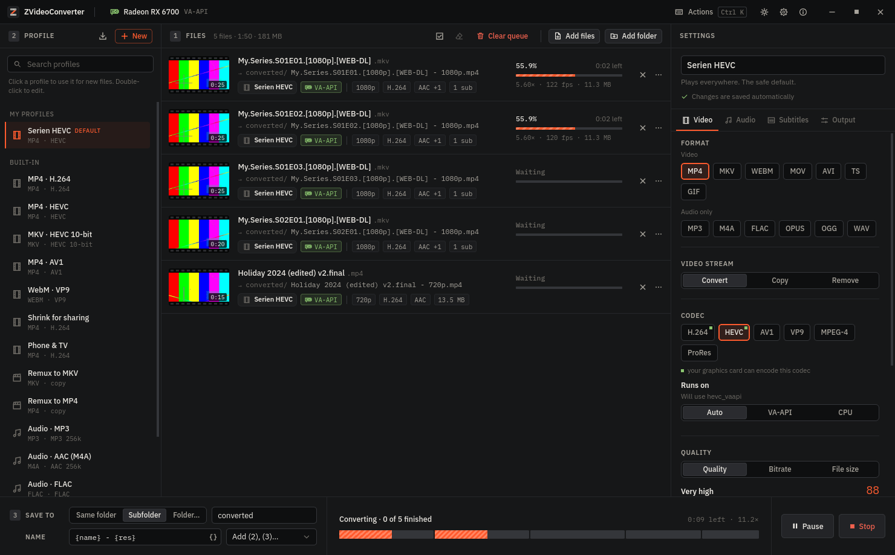

<p align="center">
  
</p>

<h1 align="center">ZVideoConverter</h1>

<p align="center">
  <b>A free, open-source bulk video converter for Windows and Linux with GPU acceleration.</b><br />
  Convert whole folders of video in one clean window, using NVIDIA NVENC, AMD AMF / VA-API or Intel Quick Sync,<br />
  with profiles you can edit and file names that come out exactly as they went in.
</p>

<p align="center">
  <a href="https://zsync.eu/zvideoconverter/"><b>Website</b></a> ·
  <a href="https://zsync.eu/zvideoconverter/">Download</a> ·
  <a href="#features">Features</a> ·
  <a href="#faq">FAQ</a> ·
  <a href="#building-from-source">Build</a> ·
  <a href="https://zsync.eu/">More projects</a>
</p>

<p align="center">
  <a href="https://www.gnu.org/licenses/gpl-3.0"></a>
  
  
  
  
</p>

<p align="center">
  
</p>

---

## Why ZVideoConverter?

It started with a request from a [ZRename](https://zsync.eu/zrename/) user. The popular bulk converter they used got the conversion itself right but made everything around it painful:

| The problem | How ZVideoConverter solves it |
|---|---|
| Menus and dialogs everywhere | **Everything in one window**, in three numbered steps: add files → pick a profile → convert. |
| Custom profiles can't be edited, only deleted and created again | **Profiles are edited in place** and saved as you type. Built-ins are duplicated with one click. |
| File names cut off at the first `.` or `[`, so `Show.S01E01.[1080p].mkv` and `Show.S01E02.[1080p].mkv` both became `Show.mp4` | **Names are never parsed.** `Show.S01E01.[1080p].mkv` becomes `Show.S01E01.[1080p].mp4`, and output collisions are resolved before anything runs. |

## Features

### Converting
- **Bulk and batch conversion**: drop files or whole folders (sub-folders included) and convert them all at once, several in parallel.
- **GPU hardware encoding and decoding**:
  - NVIDIA **NVENC**, with decoding on the GPU too (**NVDEC / CUDA**)
  - AMD **AMF** on Windows, **VA-API** on Linux (AMD and Intel), with VA-API decoding
  - Intel **Quick Sync**
  - The CPU (x264, x265, SVT-AV1, VP9) as the fallback
- **Only encoders that actually work are offered.** Every GPU encoder gets a real test encode at start-up. If a GPU encode fails anyway, the file is redone on the CPU automatically.
- **Formats**:
  - Video: MP4, MKV, WebM, MOV, AVI, TS and animated GIF, in H.264, HEVC / H.265, AV1, VP9, MPEG-4 or ProRes, with 10-bit colour
  - Audio: MP3, AAC / M4A, FLAC, Opus, OGG and WAV (extracting the soundtrack from a video works too)
- **Remux without re-encoding**: copy streams losslessly into another container. Streams that can't go into the target (DTS into MP4, for example) are converted instead of failing.

### Profiles and settings
- **14 built-in profiles**, among them MP4 H.264, MP4 HEVC, MKV HEVC 10-bit, AV1, WebM, "Shrink for sharing", "Phone & TV", remux, audio extraction and GIF.
- **Your own profiles**: edit in place, rename, duplicate, reorder, favourite, import and export (JSON).
- **Per-file settings**: change anything for just the selected files and keep the profile untouched, then reset, or save them as a new profile.
- **Rate control, all of it**, on the GPU and the CPU:
  - **Constant quality (CRF / CQ)** as a real number, the same on NVIDIA, AMD, Intel and the CPU: 18–20 high quality, 21–23 good, 24–26 more compression.
  - **Constrained quality**: that CQ plus a bitrate ceiling it never goes over.
  - **Constant bitrate (CBR)** for streaming and devices that need it, or **average bitrate (VBR)**.
  - A simple quality slider, or a **target file size** (two-pass on the CPU).
  - Five speed presets.
- **Resolution**:
  - Presets 480p (SD), 540p, 576p, 720p (HD), 1080p (Full HD), 1440p (QHD), 2160p (4K UHD) and 4320p (8K UHD). They set the shorter side, so upright phone videos work too, and never scale up.
  - **Any exact size**, for example 540 × 960 for vertical video, with black bars, crop-to-fill or stretch when the aspect ratio differs.
  - Or a maximum for the longest side.
- **Picture**: frame rate, deinterlacing, automatic black-bar cropping, HDR → SDR tone mapping, rotate and mirror.
- **Audio**: codec, bitrate, channels, sample rate, EBU R128 loudness normalisation, and all tracks or only the first.
- **Subtitles**: keep them as tracks, burn them into the picture (text and PGS/DVD), or remove them.
- **Trim** start and end per file, keep or strip metadata and chapters, web-optimised MP4, and extra ffmpeg arguments for experts.

### Output and naming
- Save next to the originals, in a subfolder, or in any folder (optionally rebuilding the folder structure).
- **Name templates** with `{name}`, `{res}`, `{vcodec}`, `{acodec}`, `{profile}`, `{date}`, `{counter}` and more. `{name}` is always the complete original name.
- Existing files are never overwritten by accident: add ` (2)`, skip, or overwrite, your choice. A file can never overwrite its own source or another job's output.

### Working with the queue
- A one-line summary before you start: *"5 files → MP4 · HEVC on the GPU (VA-API), saved next to the originals"*.
- Live progress, fps, speed and time left per file, plus a timeline of the whole batch.
- Pause (running encodes freeze on Linux; on Windows they finish first), cancel single files or everything, and add files to a run in progress.
- Unfinished outputs are written to a temporary `.zvc-part` file, so a cancelled or failed conversion never leaves a broken video behind.
- The exact ffmpeg command and log for every file, ready to copy.

### Before and after converting
- **10-second preview encode**: see the real quality and the measured file size before converting everything.
- **Before/after split view** to compare a finished file with its original frame by frame.
- **Several outputs per file**, for example an MP4 and an MP3 of the soundtrack in one run.
- **Automatic black-bar cropping**, **external subtitle files** (`Movie.de.srt`) picked up automatically, and **audio/subtitle tracks by language** in your preferred order.
- **Originals**: keep them, move them to the trash (with *Restore*), or delete them, but only after every output of that file finished and decoded cleanly. File dates can be carried over.
- **When done**: nothing, quit, sleep or shut down (with a countdown you can cancel). Progress shows in the taskbar and in a notification.
- Free-space check before starting, low-priority encoding so games and browsers stay smooth, and a queue that survives crashes and restarts.

### Automation
- **Watch folders**: new videos dropped into a folder are converted automatically with the profile you choose, once they have finished copying.
- Queue tools: filter, search, sort, retry failed files, and drag to reorder.
- **"Open with" / drag onto the icon** adds files to the running window instead of opening a second one.

### Everything else
- **ffmpeg included on demand**: it uses the system ffmpeg, or downloads a verified (SHA-256) static GPL build with one click.
- **A one-minute guided tour** on first start (with sample files to try it on), replayable any time.
- **Portable mode**: put an empty file called `portable` next to the program and all settings, profiles and caches stay in a `data` folder beside it.
- **Update check**: once a day it asks zsync.eu whether a newer version exists. Nothing is downloaded or sent, and it can be turned off in Settings.
- **English and German**. New languages are a single JSON file.
- Dark and light themes, a command palette (<kbd>Ctrl</kbd>+<kbd>K</kbd>) and keyboard shortcuts.
- Local and private: no account, no telemetry, and no uploads, ever. The only network access is the optional update check and the one-click ffmpeg download.

## Download

Get it for **Windows** (installer) and **Linux** (`.deb`, `.rpm`, AppImage) at **[zsync.eu/zvideoconverter](https://zsync.eu/zvideoconverter/)** or from the [GitHub releases](https://github.com/TheHolyOneZ/ZVideoConverter/releases). Every release comes with a `SHA256SUMS` file to check your download.

ffmpeg doesn't need to be installed: on first start the app offers a one-click download.

## How to use it

1. **Add files.** Drag videos or folders into the window, or use *Add files* / *Add folder*.
2. **Pick a profile** on the left. Adjust it on the right, either for the profile or only for the selected files.
3. **Choose where to save** and how to name the files, then press **Convert**.

| Keys | Action |
|---|---|
| <kbd>Ctrl</kbd>+<kbd>K</kbd> | Command palette |
| <kbd>Ctrl</kbd>+<kbd>O</kbd> / <kbd>Ctrl</kbd>+<kbd>Shift</kbd>+<kbd>O</kbd> | Add files / add a folder |
| <kbd>Ctrl</kbd>+<kbd>Enter</kbd> | Convert |
| <kbd>Ctrl</kbd>+<kbd>A</kbd>, <kbd>Shift</kbd> / <kbd>Ctrl</kbd>+click | Select files |
| <kbd>Delete</kbd> | Remove the selected files |
| <kbd>Ctrl</kbd>+<kbd>,</kbd> | Settings |
| Double-click or <kbd>F2</kbd> on a profile | Edit it |

## FAQ

**Does it use my graphics card?**
Yes, if ffmpeg supports it. ZVideoConverter test-encodes with every hardware encoder on start-up. Settings → Hardware shows exactly which codecs your GPU can encode, and *Auto* picks the best one. For example, an AMD RX 6000 card encodes H.264 and HEVC but not AV1, and the app knows that.

**What happens to file names with dots, brackets or special characters?**
Nothing. The name is taken as a whole and only the final extension changes. Dots, `[brackets]`, `(parentheses)`, `{braces}`, `%`, spaces and Unicode are all kept.

**Do I need to install ffmpeg?**
No. If none is found, ZVideoConverter offers a one-click download of a static GPL build from [BtbN/FFmpeg-Builds](https://github.com/BtbN/FFmpeg-Builds), checks its SHA-256 and keeps it in its own folder. An installed ffmpeg, or one you point to, works as well.

**Which rate control modes work on which encoder?**

| | CQ / CRF | CQ + bitrate ceiling | CBR | VBR |
|---|---|---|---|---|
| CPU (x264, x265) | ✓ | ✓ | ✓ | ✓ |
| CPU (SVT-AV1) | ✓ | ✓, the ceiling is approximate | ✓ (low-delay mode) | ✓ |
| NVIDIA NVENC | ✓ | ✓ | ✓ | ✓ |
| VA-API (Linux) | ✓ | ✓, but the driver decides how strictly: AMD's Mesa driver treats the ceiling as a soft limit | ✓ | ✓ |
| AMD AMF (Windows) | ✓ | CQ only, the ceiling is not applied (the log says so) | ✓ | ✓ |
| Intel Quick Sync | ✓ | ✓ | ✓ | ✓ |

The CQ number means the same everywhere: it goes to H.264 and HEVC encoders as is, and AV1 encoders get the equivalent on their own scale.
CPU and VA-API rows are measured with real encodes in the test suite; the NVENC, AMF and Quick Sync rows are checked against the exact ffmpeg options but haven't run on those cards in the tests yet.

**Is it really free?**
Yes. It is free software under the GPL-3.0: no ads, no account, no watermark.

**Which systems are supported?**
Windows 10/11 (64-bit) and Linux (64-bit, X11 and Wayland).

## Building from source

Requirements: [Rust](https://rustup.rs/) (stable), [Node.js](https://nodejs.org/) 20+, [pnpm](https://pnpm.io/), and the [Tauri v2 prerequisites](https://v2.tauri.app/start/prerequisites/) for your OS.

```bash
git clone https://github.com/TheHolyOneZ/ZVideoConverter.git
cd ZVideoConverter
pnpm install
pnpm tauri dev      # run in development
pnpm tauri build    # installers: NSIS on Windows; .deb / .rpm / AppImage on Linux
```

### Release builds

The GitHub Actions workflow [`.github/workflows/release.yml`](.github/workflows/release.yml) builds everything:

- **Linux** (`.deb`, `.rpm`, AppImage) on Ubuntu 22.04, so the packages also run on older distributions (glibc 2.35). The build fails if the binary needs anything newer.
- **Windows** (NSIS installer) on a Windows runner.

Before building, it runs the engine tests on both systems with a real ffmpeg, plus the app's one-click ffmpeg download (download, SHA-256 check, unpack, encode).

- *Actions → Release → Run workflow* builds the files and attaches them to the run.
- Pushing a tag like `v0.1.1` also creates a **draft** GitHub release with all files and `SHA256SUMS`, ready to publish. The tag has to match the version in `tauri.conf.json`.

The Linux packages can also be built locally in an Ubuntu 22.04 container:

```bash
scripts/build-linux-release.sh   # needs Docker; output in target/ubuntu22/release/bundle/
```

Tests and checks:

```bash
cargo test -p zvc-core   # engine tests, including real encodes with the ffmpeg on PATH (every output is fully
                         # decoded; CBR, CQ, constrained quality and all resolution modes are measured)
cargo test -p zvc-core --test ffmpeg_download -- --ignored   # the one-click ffmpeg download, for real (~100 MB)
pnpm test                # frontend tests
pnpm i18n:check          # translation coverage and placeholder consistency
```

Project layout:

```
crates/zvc-core/   conversion engine: probing, profiles, naming, GPU detection, ffmpeg arguments, job queue
src-tauri/         desktop shell (Tauri v2): commands and app state
src/               user interface (React + TypeScript): components, stores, locales
scripts/           tooling (translation checker, Linux release build in Docker)
```

### Adding a language

1. Copy `src/locales/en.json` to `src/locales/<code>.json` (for example `fr.json` or `pt-BR.json`).
2. Set `"_meta": { "name": "Français", "english": "French" }` and translate as much as you like. Anything missing falls back to English.
3. Run `pnpm i18n:check` to find missing keys, typos and broken `{placeholders}`.

## Links

- **Website and downloads:** [zsync.eu/zvideoconverter](https://zsync.eu/zvideoconverter/)
- **Source code:** [github.com/TheHolyOneZ/ZVideoConverter](https://github.com/TheHolyOneZ/ZVideoConverter)
- **Author:** [TheHolyOneZ on GitHub](https://github.com/TheHolyOneZ)
- **More tools by the same author:** [zsync.eu](https://zsync.eu/)
- **Game mode:** [zlogic.eu](https://zlogic.eu/)

## License

ZVideoConverter is © 2026 **TheHolyOneZ** and is licensed under the **[GNU General Public License v3.0](LICENSE)**.

It runs [FFmpeg](https://ffmpeg.org/) as a separate program. FFmpeg is © the FFmpeg developers and licensed under the LGPL/GPL.

<sub>Keywords: bulk video converter, batch video converter, GPU video converter, hardware accelerated video encoding, NVENC, AMD AMF, VA-API, Intel Quick Sync, HEVC / H.265 converter, AV1 encoder, CRF / CQ constant quality, CBR, NVDEC, 4K and 8K video, MKV to MP4, FFmpeg GUI, FormatFactory alternative, HandBrake alternative, free video converter for Windows and Linux.</sub>
